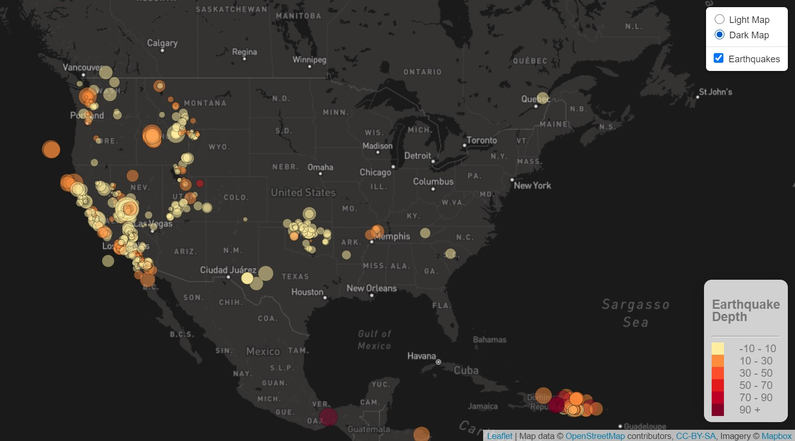
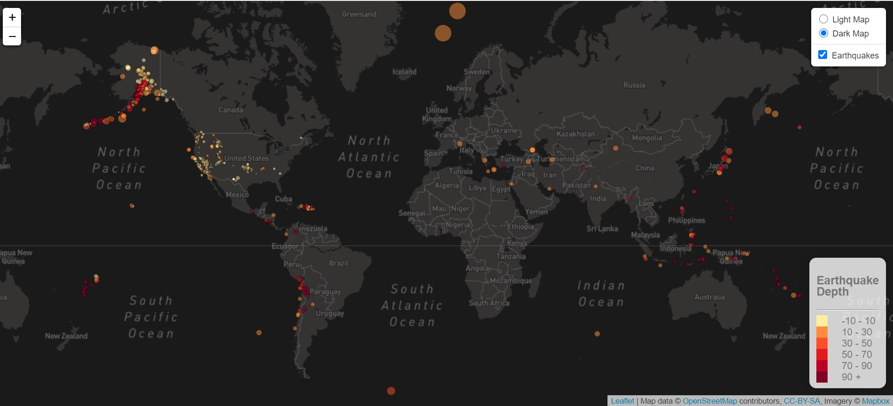

# Depth & Magnitude: Visualizing Data with Leaflet

Check out the live website: https://minerva-b.github.io/Leaflet-Challenge/
The USGS GeoJSON data updates every 5 minutes. Therefore, when the site is visited it will display the most recent earthquake data.

Below are some screenshots of the final product:
---

### A view of North America

*Note: Image captured 12.18.2020

### A view of the World

*Note: Image captured 12.18.2020

If you wish to give this a try follow the instructions below:
---
## Background

Welcome to the United States Geological Survey, or USGS for short! The USGS is responsible for providing scientific data about natural hazards, the health of our ecosystems and environment; and the impacts of climate and land-use change. Their scientists develop new methods and tools to supply timely, relevant, and useful information about the Earth and its processes. As a new hire, you will be helping them out with an exciting new project!

The USGS is interested in building a new set of tools that will allow them visualize their earthquake data. They collect a massive amount of data from all over the world each day, but they lack a meaningful way of displaying it. Their hope is that being able to visualize their data will allow them to better educate the public and other government organizations (and hopefully secure more funding..) on issues facing our planet.

### Before You Begin

1. Create a new repository for this project called `leaflet-challenge`. **Do not add this homework to an existing repository**.

2. Clone the new repository to your computer.

3. Inside your local git repository, create a directory for the Leaflet challenge. Use the folder names to correspond to the challenges: **Leaflet-Step-1** and **Leaflet-Step-2**.

4. This homeworks utilizes both **html** and **Javascript** so be sure to add all the necessary files. These will be the main files to run for analysis.

5. Push the above changes to GitHub or GitLab.

## Your Task

### Level 1: Basic Visualization

Your first task is to visualize an earthquake data set.

1. **Get your data set**

   The USGS provides earthquake data in a number of different formats, updated every 5 minutes. Visit the [USGS GeoJSON Feed](http://earthquake.usgs.gov/earthquakes/feed/v1.0/geojson.php) page and pick a data set to visualize. When you click on a data set, for example 'All Earthquakes from the Past 7 Days', you will be given a JSON representation of that data. You will be using the URL of this JSON to pull in the data for our visualization.

2. **Import & Visualize the Data**

   Create a map using Leaflet that plots all of the earthquakes from your data set based on their longitude and latitude.

   * Your data markers should reflect the magnitude of the earthquake by their size and and depth of the earth quake by color. Earthquakes with higher magnitudes should appear larger and earthquakes with greater depth should appear darker in color.

   * **HINT** the depth of the earth can be found as the third coordinate for each earthquake.

   * Include popups that provide additional information about the earthquake when a marker is clicked.

   * Create a legend that will provide context for your map data.

- - -

### Copyright

Trilogy Education Services © 2019. All Rights Reserved.
